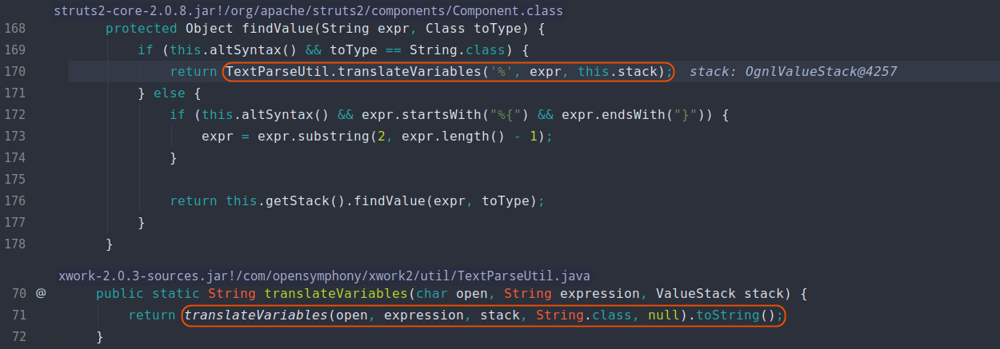

本系列文章将详细分析 **Java** 流行框架 **Struts2** 的历史漏洞，今后关于 **Struts2** 新的漏洞分析，也将更新于 [Struts2-Vuln](https://github.com/Mochazz/Struts2-Vuln) 项目上。该系列仅是笔者初学 **Java代码审计** 的一些记录，也希望能够帮助到想学习 **Java代码审计** 的朋友 。如有任何问题，欢迎 **issue** 。分析文章均来自 [**个人博客**](https://mochazz.github.io) ，转载请注明出处。

## 漏洞概要

Struts2-001是一个远程代码执行漏洞

漏洞影响版本： **Struts 2.0.0 - Struts 2.0.8** 。更多详情可参考官方通告：https://cwiki.apache.org/confluence/display/WW/S2-001 

## 漏洞环境

Apache Tomcat/8.5.47+struts-2.0.8

下载地址：http://archive.apache.org/dist/struts/binaries/struts-2.0.8-all.zip 

https://github.com/vulhub/vulhub/tree/master/struts2/s2-001

## 漏洞分析

 **Struts2** 框架对于数据的整个处理可以参考下图：


从上图，我们可以看出当一个 **HTTP** 请求被 **Struts2** 处理时，会经过一系列的 **拦截器(Interceptor)** ，这些拦截器可以是 **Struts2** 自带的，也可以是用户自定义的。例如下图 **struts.xml** 中的 **package** 继承自 **struts-default** ，而 **struts-default** 就使用了 **Struts2** 自带的拦截器。


在 **struts2-core-2.0.8.jar!/struts-default.xml** 文件中，我们可以找到默认使用的拦截器栈 **defaultStack** 。


在拦截器栈 **defaultStack** 中，我们需要关注 **params** 这个拦截器。其中， **params拦截器** 会将客户端请求数据设置到 **值栈(valueStack)** 中，后续 **JSP** 页面中所有的动态数据都将从值栈中取出。


经过一系列的拦截器处理后，数据会成功进入实际业务 **Action** 。程序会根据 **Action** 处理的结果，选择对应的 **JSP** 视图进行展示，并对视图中的 **Struts2** 标签进行处理。如下图，在本例中 **Action** 处理用户登录失败时会返回 **error** 。


根据返回结果以及先前在 **struts.xml** 中定义的视图，程序将开始处理 **index.jsp** 。


当在 **JSP** 文件中遇到 **Struts2** 标签 **<s:textfield** 时，程序会先调用 **doStartTag** ，并将标签中的属性设置到 **TextFieldTag** 对象相应属性中。最后，在遇到 **/>** 结束标签的时候调用 **doEndTag** 方法。


在 **doEndTag** 方法中调用了 **this.component.end** 方法，而该方法调用了 **evaluateParams** 方法来填充 **JSP** 中的动态数据。


跟进 **evaluateParams** 方法，会发现如果开启了 **Ognl** 表达式支持( **this.altSyntax()** )，程序会在属性字段两边添加 **Ognl** 表达式字符( **%{、}** )，然后使用 **findValue** 方法从值栈中获得该表达式所对应的值。


我们来看下 **findValue** 方法中，具体是如何解析 **Ognl** 表达式。如下图，可以看到 **findValue** 方法先调用了 **translateVariables** 方法，该方法又调用了同名重载方法。问题关键，就在这个同名重载方法中。



在最开始，我们传入 **translateVariables** 方法的表达式 **expression** 为 **%{username}** ，经过 **Ognl** 表达式解析，程序会获得其值 **%{1+1}** 。这个值在先前经过 **params** 拦截器的时候设置了，前面我们也说过。由于此处使用的是 **while** 循环来解析 **Ognl** ，所以获得的 **%{1+1}** 又会被再次执行，最终也就造成了任意代码执行。


我们来尝试弹个计算器：

```java
%{(new java.lang.ProcessBuilder(new java.lang.String[]{"deepin-calculator"})).start()}
```


## 漏洞修复

下图右边为官方修复后的代码（左图xwork-2.0.3，右图为xwork-2.0.4），可以明显看到在修复代码中多了 **Ognl** 递归解析次数的判断，默认情况下仅解析第一层。


## 参考

[【Struts2-命令-代码执行漏洞分析系列】S2-001](https://xz.aliyun.com/t/2044) 