本系列文章将详细分析 **Java** 流行框架 **Struts2** 的历史漏洞，今后关于 **Struts2** 新的漏洞分析，也将更新于 [Struts2-Vuln](https://github.com/Mochazz/Struts2-Vuln) 项目上。该系列仅是笔者初学 **Java代码审计** 的一些记录，也希望能够帮助到想学习 **Java代码审计** 的朋友 。如有任何问题，欢迎 **issue** 。分析文章均来自 [**个人博客**](https://mochazz.github.io) ，转载请注明出处。

## 漏洞概要

Struts2-002是一个 **XSS** 漏洞，该漏洞发生在 **\<s:url>** 和 **\<s:a>** 标签中，当标签的属性 **includeParams=all** 时，即可触发该漏洞。

漏洞影响版本： **Struts 2.0.0 - Struts 2.1.8.1** 。更多详情可参考官方通告：https://cwiki.apache.org/confluence/display/WW/S2-002 

## 漏洞环境

Apache Tomcat/8.5.47+struts-2.0.8

下载地址：http://archive.apache.org/dist/struts/binaries/struts-2.0.8-all.zip 

https://github.com/vulhub/vulhub/tree/master/struts2/s2-001

## 漏洞分析

从先前的文章，我们可以知道。当程序开始解析 **Struts** 标签时，会调用 **org.apache.struts2.views.jsp.ComponentTagSupport:doStartTag()** 方法。

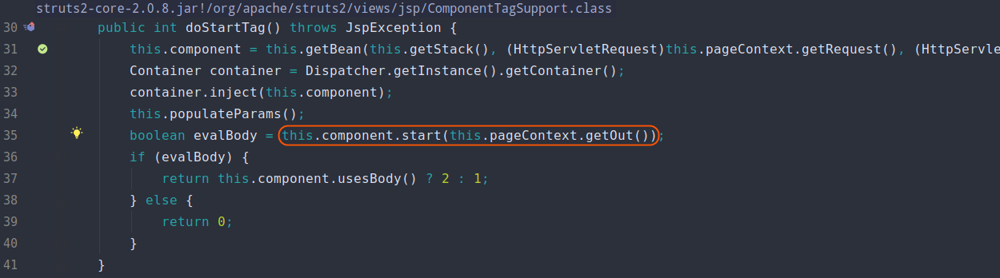

由于我们这里处理的是 **\<s:url>** 标签，所以这里用来处理标签的组件 **this.component** 为**org.apache.struts2.components.URL** 类对象。我们跟进 **URL:start()** 方法。

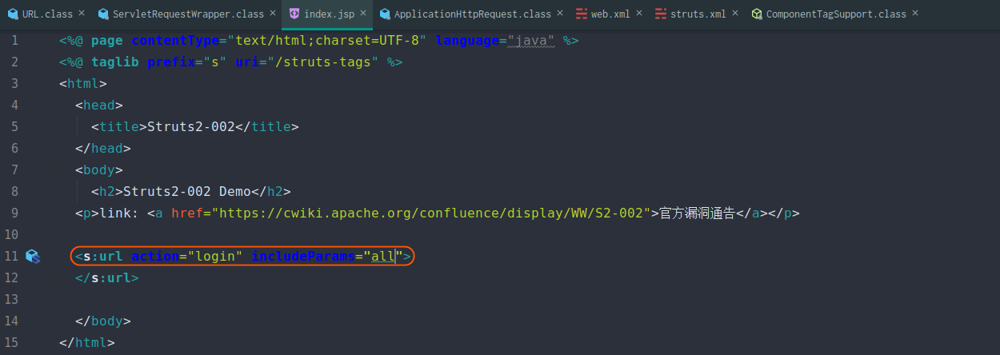

在 **URL:start()** 方法中，我们看到当 **includeParams=all** 时，会调用 **mergeRequestParameters** 方法。

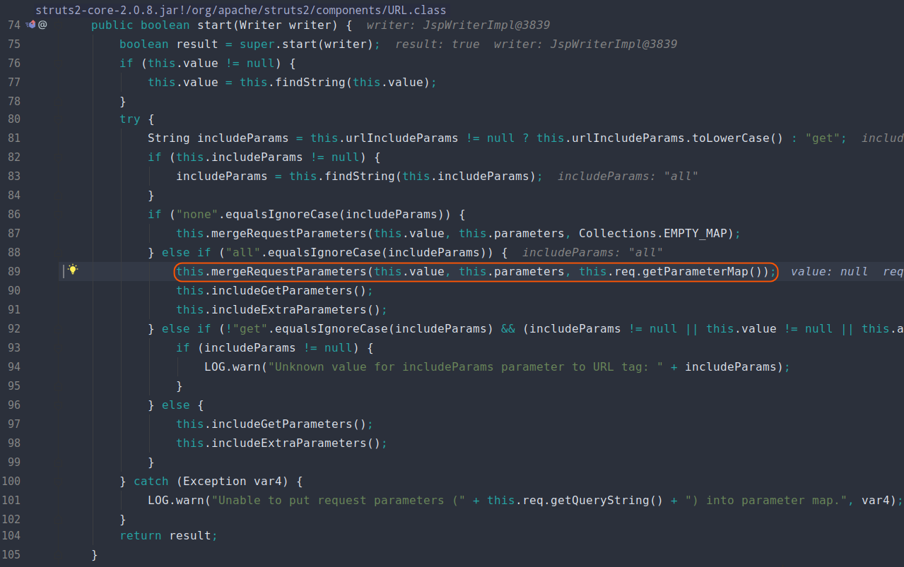

在 **mergeRequestParameters** 方法中，程序会将 **this.req.getParameterMap()** 获得的键值对数据存入 **this.parameters** 属性。

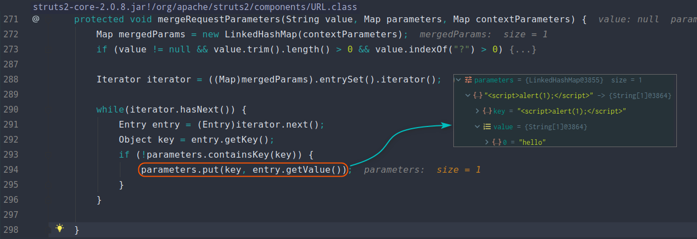

在 **mergeRequestParameters** 方法之后，依次是 **includeGetParameters、includeExtraParameters** 方法。 **includeGetParameters** 方法主要是将 **HttpRequest.getQueryString()** 的数据存入 **this.parameters** 属性，而 **includeExtraParameters** 方法则用来存入其它数据。

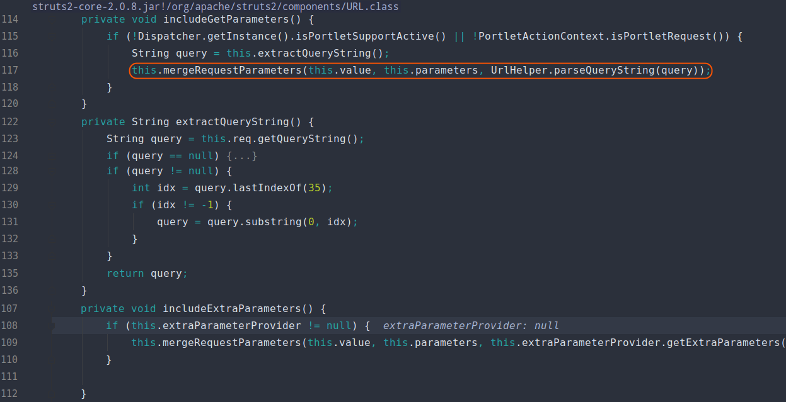

最后会由 **URLHelper** 类处理 **this.parameters** 数据（将其拼接在URL中）并返回给用户，这也导致最终的 **XSS** 漏洞。

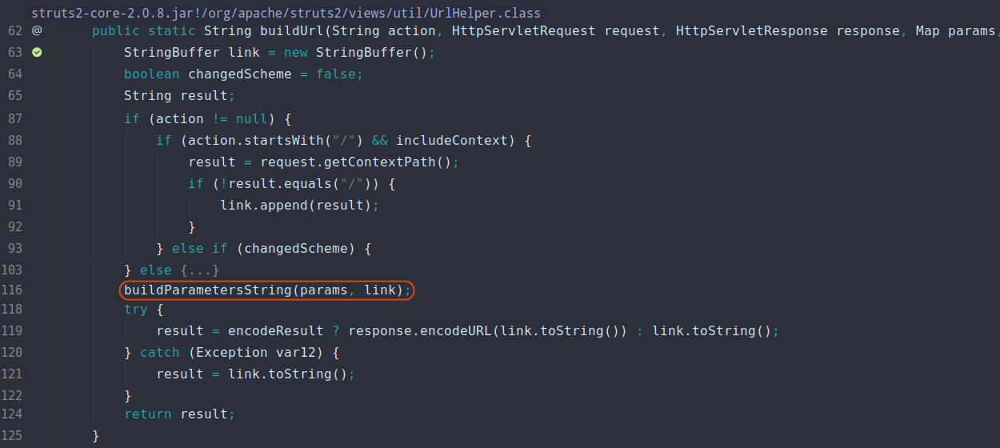

来试下触发 **XSS** 漏洞：

```
http://localhost:8081/struts2-001/login.action?<script>alert(1);</script>=hello
```

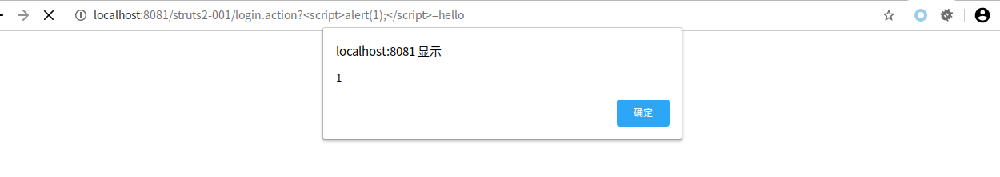

在查看官方漏洞通告的时候，发现官方说的是 **includeParams** 设置成除了 **none** 以外值都能触发漏洞。本以为 **includeParams=get** 也能成功，但是实际测试发现并不能触发 **XSS** 漏洞。

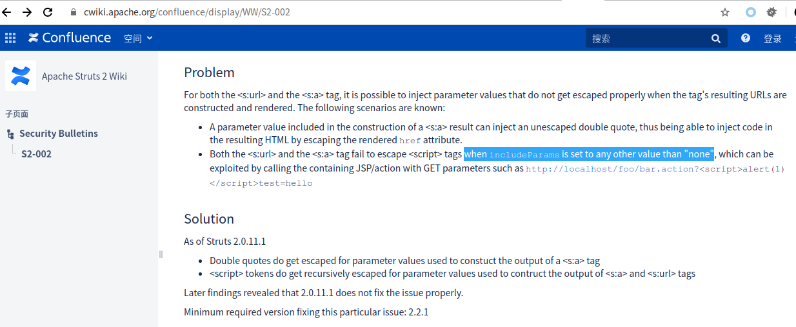

主要原因在于：当 **includeParams=all** 时，会多执行一个 **mergeRequestParameters** 方法，而该方法会将 **this.req.getParameterMap()** 数据设置到 **this.parameters** 。如果 **includeParams=get** ，那么 **this.parameters** 中的数据，仅是来自 **this.req.getQueryString()** 。

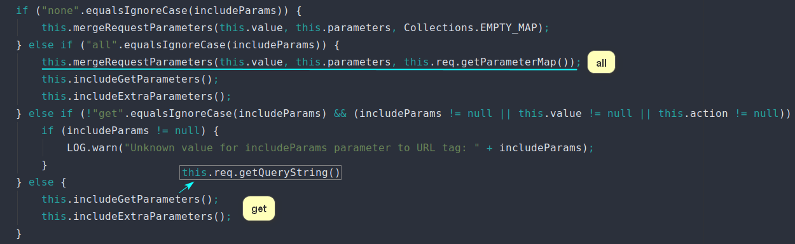

而 **this.req.getParameterMap()** 获得的数据会主动进行 **URLdecode** ，但是 **this.req.getQueryString()** 不会。所以 **includeParams=get** 时，返回的数据是被 **URLencode** 过的，因此不能触发 **XSS** 漏洞。大家可以再通过下图示例代码加深理解：

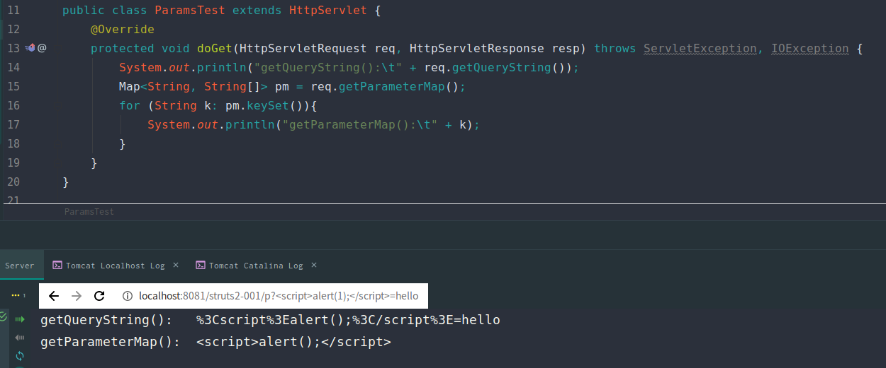

## 漏洞修复

下图右边为官方修复后的代码（左图struts-core-2.0.8，右图为struts-core-2.0.11.1），可以明显看到修复代码仅仅是将 **\<script>** 替换成 **script** 了。然而这种修复方式明显可以绕过，例如：`<script 1>alert(1)</script>`

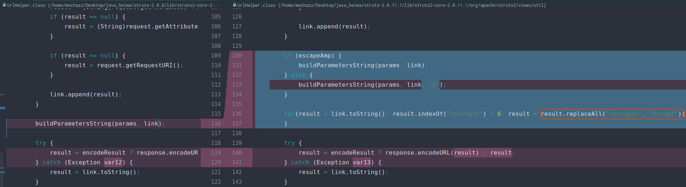

## 参考

[Struts2框架: S2-002 漏洞详细分析](https://dean2021.github.io/posts/s2-002/) 